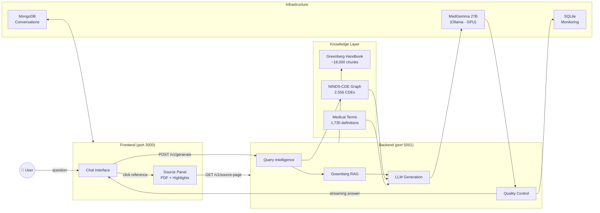
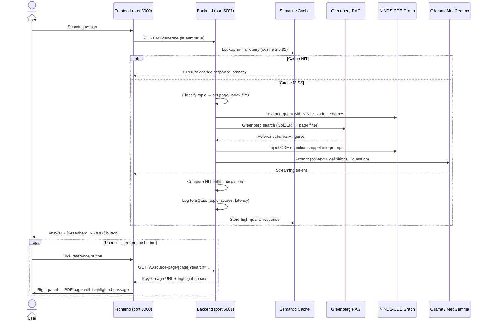
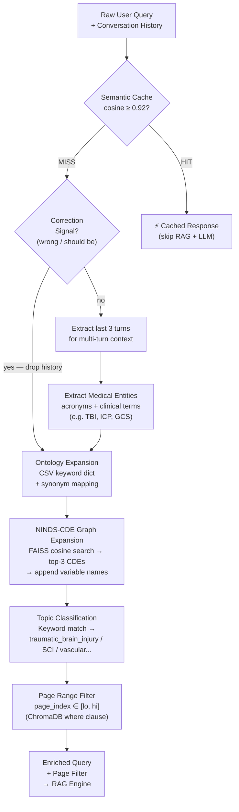
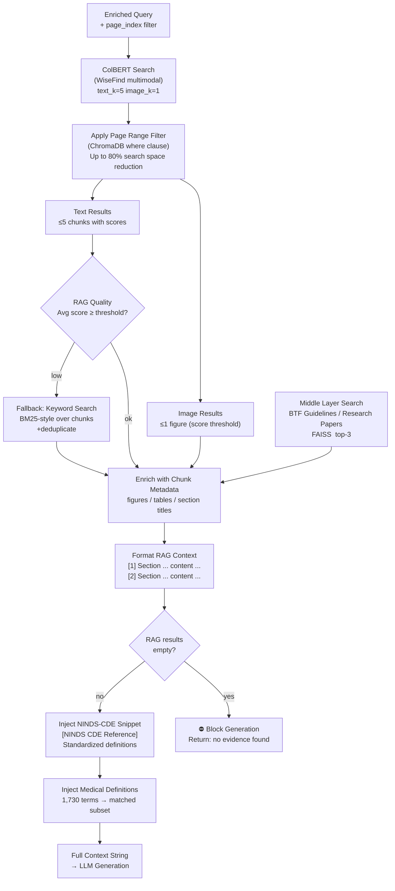
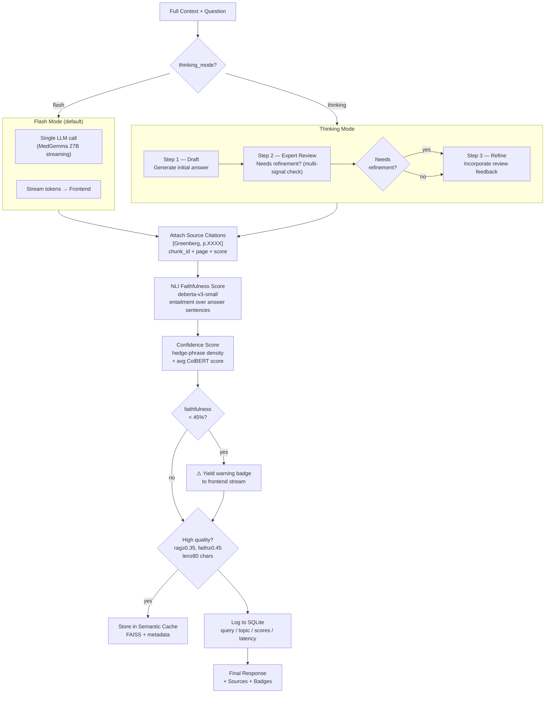
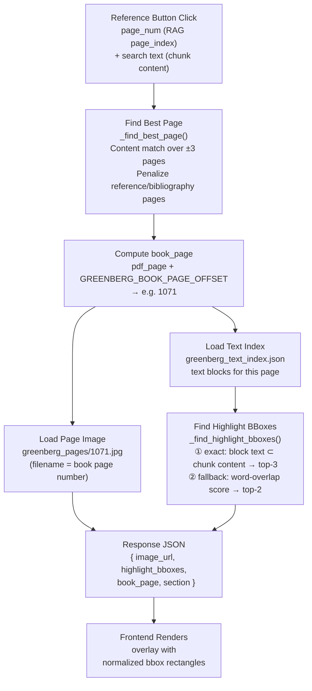
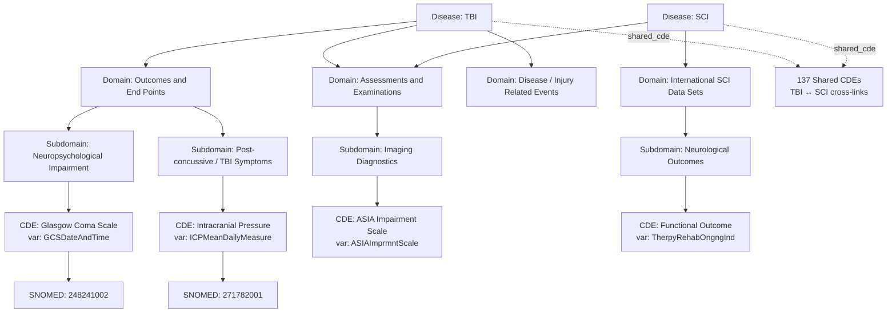
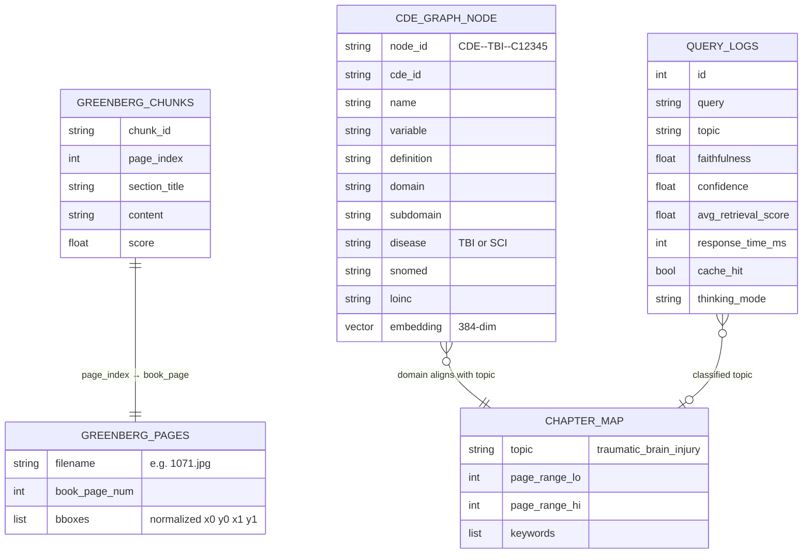
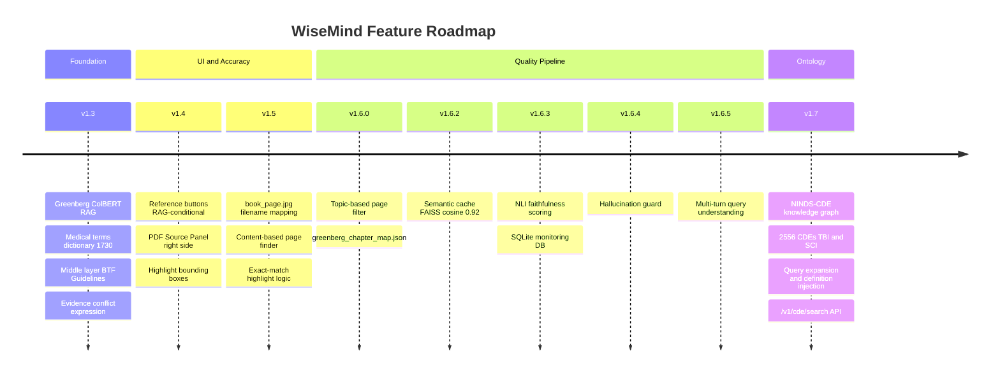

# WiseMind System Architecture

> Version: v1.7.0 | Updated: 2026-04-12

---

## Level 1 — High-Level Overview

> Three core layers: what the user sees, what processes the request, and what data powers it.

---

## Level 2 — Query Processing Flow

> End-to-end sequence from user input to final streamed answer.

---

## Level 2 — Module: Query Intelligence

> How a raw user query is enriched before hitting the RAG engine.

---

## Level 2 — Module: Greenberg RAG Pipeline

> How the handbook is searched and results are assembled into context.

---

## Level 2 — Module: LLM Generation & Quality

> Two generation modes and post-generation quality scoring.

---

## Level 2 — Module: Source Reference Display

> How a reference button click becomes a highlighted PDF page.

---

## Level 3 — NINDS-CDE Knowledge Graph Structure

---

## Level 3 — Data Layer Schema

---

## Feature Timeline

---

## API Endpoints Reference

| Endpoint | Method | Description |
|---|---|---|
| `/v1/generate` | POST | Main chat generation — Flash / Thinking, streaming SSE |
| `/v1/health` | GET | Service health check |
| `/v1/source-page/[page]` | GET | Greenberg page image URL + highlight bboxes |
| `/v1/source-page-img/[page]` | GET | Serve book page JPEG directly |
| `/v1/cde/search?q=&k=` | GET | Semantic search over NINDS-CDE graph |
| `/v1/admin/metrics?days=` | GET | Aggregated query stats from SQLite |

---

## Infrastructure Summary

| Component | Technology | Location | Notes |
|---|---|---|---|
| Frontend | SvelteKit + Vite | port 3000 | `nohup npm run dev` |
| Backend | Flask + Gunicorn 4 workers gevent | port 5001 | Docker `wisemind-backend` |
| LLM Serving | Ollama | port 11434 | `systemctl ollama` |
| GPU | NVIDIA GB10 DGX Spark ARM | host | `--runtime=nvidia --gpus all` |
| Database | MongoDB | localhost | Conversations + sessions |
| Monitoring | SQLite | `/workspace/WiseMind/wisemind_monitor.db` | Query logs |
| Knowledge Graph | NetworkX + FAISS | `/workspace/WiseMind/ninds_cde_graph/` | 15 MB total |
| RAG Index | ColBERT WiseFind | `/workspace/WiseMind/` | Greenberg handbook |
