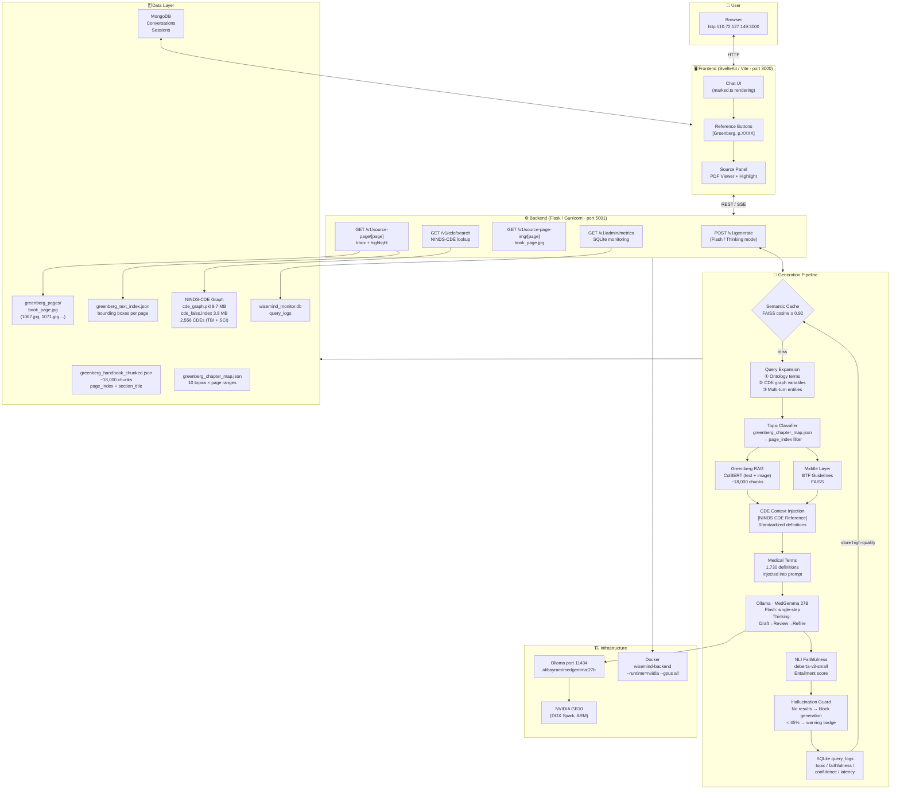
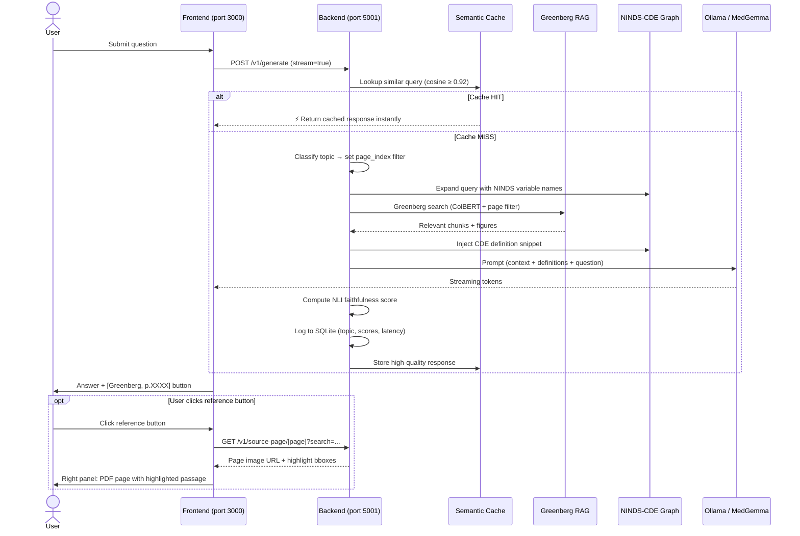
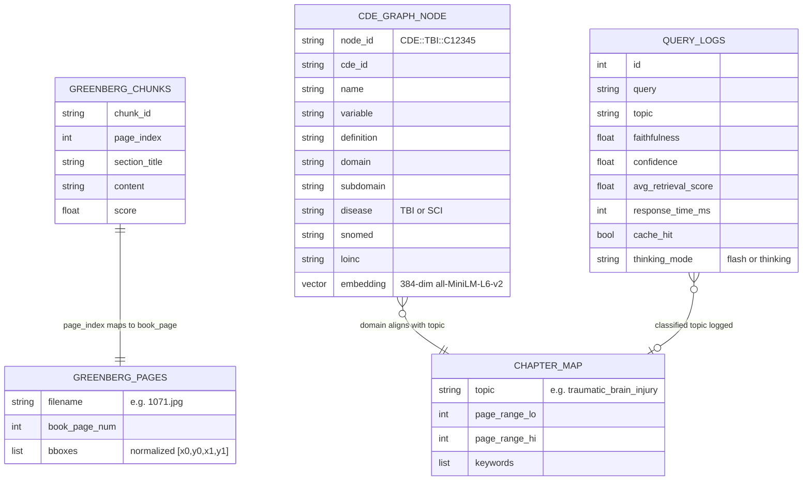
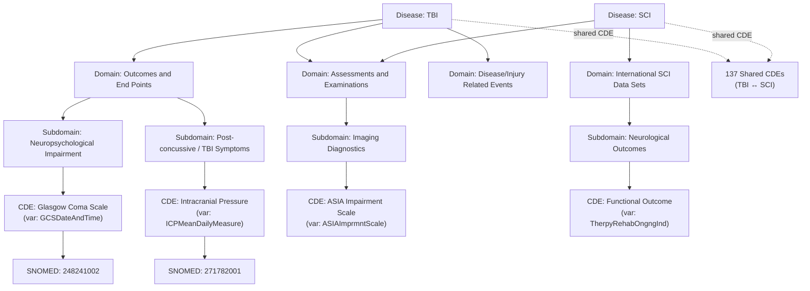
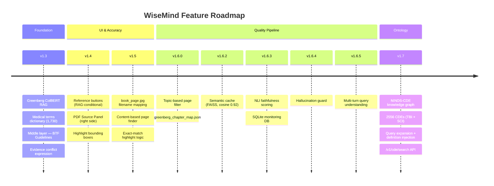

# WiseMind System Architecture

> Generated: 2026-04-12 | Version: v1.7.0

---

## 1. Overall System Architecture

---

## 2. Query Processing Flow (Sequence Diagram)

---

## 3. Data Layer Schema

---

## 4. NINDS-CDE Knowledge Graph Structure

---

## 5. Feature Roadmap by Version

---

## 6. API Endpoints Reference

| Endpoint | Method | Description |
|---|---|---|
| `/v1/generate` | POST | Main chat generation (Flash / Thinking, streaming SSE) |
| `/v1/health` | GET | Service health check |
| `/v1/source-page/[page]` | GET | Greenberg page image URL + highlight bboxes |
| `/v1/source-page-img/[page]` | GET | Serve book page JPEG directly |
| `/v1/cde/search?q=&k=` | GET | Semantic search over NINDS-CDE graph |
| `/v1/admin/metrics?days=` | GET | Aggregated query stats from SQLite |

---

## 7. Infrastructure Summary

| Component | Technology | Host | Notes |
|---|---|---|---|
| Frontend | SvelteKit + Vite | port 3000 | `nohup npm run dev` |
| Backend | Flask + Gunicorn (4 workers, gevent) | port 5001 | Docker `wisemind-backend` |
| LLM Serving | Ollama | port 11434 | `systemctl ollama` |
| GPU | NVIDIA GB10 (DGX Spark, ARM) | host | `--runtime=nvidia --gpus all` |
| Database | MongoDB | localhost | Conversations + sessions |
| Monitoring | SQLite | `/workspace/WiseMind/wisemind_monitor.db` | Query logs |
| Knowledge Graph | NetworkX + FAISS | `/workspace/WiseMind/ninds_cde_graph/` | 15 MB total |
| RAG Index | ColBERT (WiseFind) | `/workspace/WiseMind/` | Greenberg handbook |
